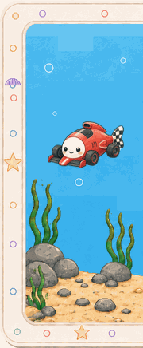
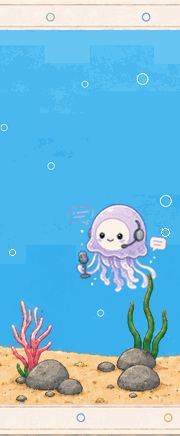
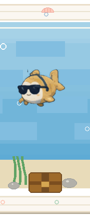
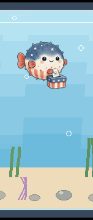
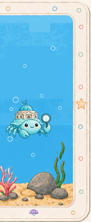

<h1 align="center">hi, i'm lucía 👋</h1>

  <samp>applied AI grad student + solutions architect @ microsoft :)</samp>
   
  <samp>building things for fun (and occasionally usefulness)</samp>

    

 

<h2 align="center">🫧 this is where my fun side quests live (literally!)</h2>

  click a fish to explore its repo 🐠

  <i>please don’t tap the glass, the fish are probably breaking something</i>

 

## about me 💻
TBD

## toolkit 🛠️

 

python · machine learning · genAI · agents · cloud · data · devops · mildly unnecessary side projects

